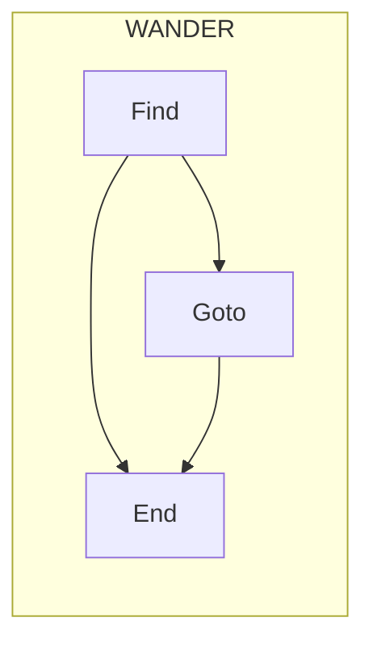
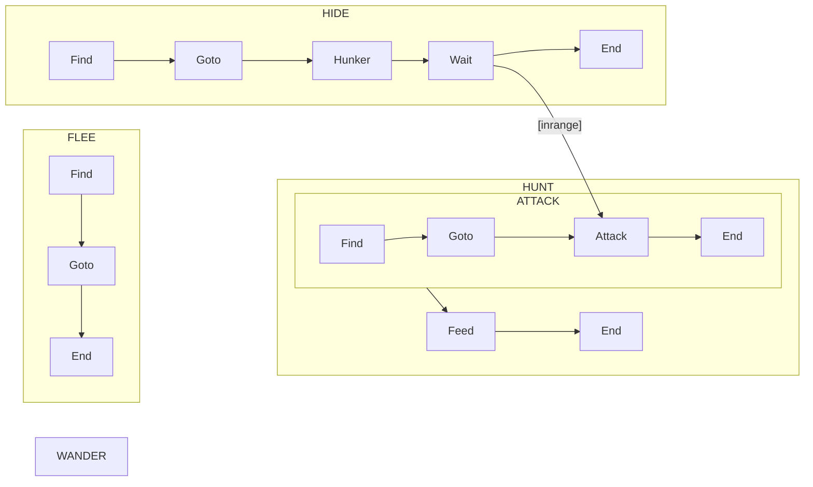
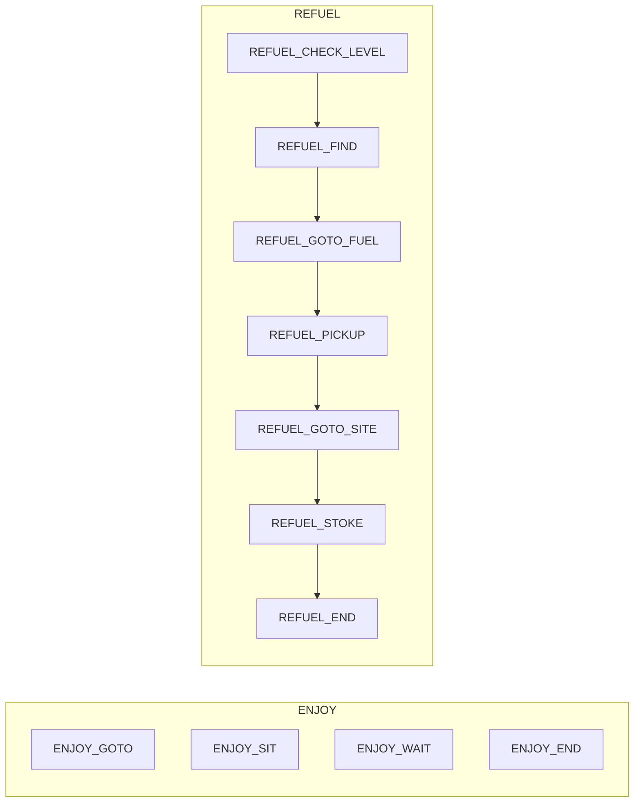

The [Previous post]() covers the theory and practice of programmer's state machines.
At the end I linked to code for a `State` which can be started/stopped/paused/unpaused based on its relationship to parent/parent/child/child state(s).

Now I want to use it to solve the actual problem I've got with animating my **M**obile **OB**jects around a scene in fun ways.

# The Problem

In my current game, I want the player to be able to disarm weapons from enemies.
This means it's a real possibility that an enemy will find themselves _without_ a weapon and within striking range of the player.
When that happens, I want them to get some distance to safety, find a weapon, and jump back into the fray.

So: their behavior has to have some branches that can prioritize somewhat complex behavior.

Let's start with walking, and build their overall behavior from the bottom up.

# Actions: It's the concrete steps of what we do

Let's assume we've put every "ability" a creature can have into a single folder under their node, something like:
```
\ Actions(Node) # Just a folder!
  \ Run
  \ Crouch
  \ WalkFunny  # Like a crab!
  \ Backstab
  \ ChargeAttack
  \ CastSpellFireball
  \ CastSpellInvisibility
  \ CastSpellTeleport
  \ FlinchInvoluntary
  \ DieInvoluntary
  \ ...
```

We can interrogate nodes by treating them as data!

```
@abstract
class_name Action extends State
@export var runner: State

# When we set this, we add ourselves as a child to the runner
# for the duration of the action, until we call `end`.
@abstract func execute(...params) -> void

# Return type: `Array[ParamDescriptor]`
# ParamDescriptor is `{"name": StringName, "optional"?: bool, "type": type}`
# where type = `VariantType|[TYPE_ARRAY, type]|[TYPE_DICTIONARY, type, type]`
func get_do_action_param_metadata(): Array
```

# Drives: It's the generic idea of what a MOB *could* do

One simple drive we could give our MOBs is the drive to WANDER.



We know when we're done a-wandering: when we get where we were going (or decide we can't get there, etc).

There's a lot of actions we could choose to implement `WANDER_GOTO`: `Run`, `Crouch`, `WalkFunny`, or `CastSpellTeleport`.
`WANDER_FIND` is a little more restricted in this case, though in other drives it could be a lot more specific.

The idea is that WANDER's job is to make those decisions: figure out if we're done (very low utility to do it again!), figure out where we want to wander towards (might figure into utility if the only places we can wander suck), figure out how we want to wander (using which skills), and then apply the state machine until it terminates (or _is_ terminated, such as by some higher utility drive preempting WANDER).

This itself sounds like a state machine.

```
class_name Drive extends SubState
# When this is called, we get the chance to consider a new plan.
# This might do any amount of actual planning (to produce a better utility number).
# Or it might cheat and just provide a general estimate of utility.
# If this overestimates utility
# ("yes, run to safety", 'ok, running away wins! what's the plan?' "oh.. nowhere is safe ;_;")
# then we'll make pretty bad decisions.
@abstract func recalculate_utility() -> float

class_name Drives extends Drive
# These are the drives we'll hold elections between; the winner is set as this Drives' substate.
# Might just be `get_children()` in practice!
#
# It's critical that we call `recalculate_utility` at relevant intervals, because that's what allows
# preemption of previous plans.
var subdrives: Array[Drive]
```

## Interactions between lots of drives make things interesting


Complex stuff! states, nested subgraphs, drives that include sub-drives to ensure delightful behaviors.

# Social Objects: Keeping the campfire stoked

I have a second concern. I'm not going to build it up front necessarily, but it has a place in the game.

Social objects.

Imagine a scene with a campfire. If there's nothing else going on, I think it would be nice if NPCs
that were capable of certain actions (a suite of actions like "sit", "move", "pickup", and "drop") could sit around the campfire!

The campfire has a freefloating drive which it can temporarily grant others:

with the idea that we give any PC or NPC that _can_ take Social Object drives into account an additional Social ObjectDrive as a child, whose set of electable subdrives is populated as clones from those social objects to which they are attached, or those which they were recently executing, etc.

Neat, huh?