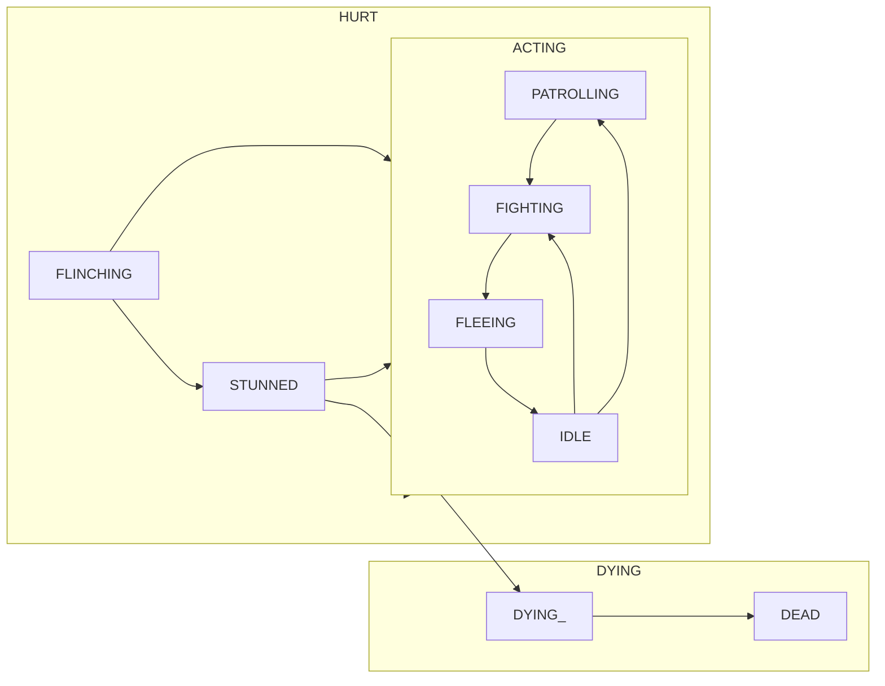

Being a brief overview on how I'm currently thinking about **M**obile **OB**ject intelligent behavior.
The goal is to get the **MOB**s in our games behaving in fun ways.
This implies a certain amount of plausible reactivity, goal setting, etc.

I'm writing this half as a design doc for a current feature, but also so I have a few headings I can post when people ask for certain kinds of help on the Godot discord.

# The simplest mob AI: Nothing
The mob is not responsive.
You might layer animations on top of this.
So this might work for a passive hazard like a lava pit, or a mobile-but-nonreactive hazard like spinning blades or dripping acid.
Physics objects like projectiles

# State Machines
We all know and love them (and if you don't yet: you will be).

> Why state machines?  
> [The canonical reference explains it better than I want to try to explain it](https://gameprogrammingpatterns.com/state.html).  
> Basically: because you want something's behavior to alter based on hidden state variables and want to modularize your code.
> "This thing is either Patrolling or Attacking or Fleeing"; and its behavior is different in each state.
> So we might produce a state graph like
> ```mermaid
> graph TD;
>   Patrolling --> Attacking
>   Patrolling --> Fleeing
>   Attacking --> Patrolling
>   Attacking --> Fleeing
>   Fleeing --> Patrolling
>   Fleeing --> Attacking
> ```

The mathematical use of state machine cares about producing behavior-without-code: you name states, an input alphabet, and transitions between states based on input; this is enough to produce behavior!
Programmers deal with the state machine a little differently; they care a lot more having an object whose internal state allows it to behave differently to the same API calls and cleanly transition into and out of different modes.
I'll use the second definition here.
This naturally deemphasizes transitions (we'll handle them implicitly, via the implementations of our states).

The simplest little state machine implementation is something like:
```
class_name FuncState extends RefCounted
var state := _start: set=set_state
func step(...params): set_state(state.callv(params))
func _start(..._ignore_me): return _end  # Override me!
func _end(..._ignore_me): pass
func set_state(next: Variant):
  if state == next: return
  if next is Callable: state = next  
```
which has all the moving parts it needs, though ofc you can add many more bells and whistles.

Notes of interest:
* I don't use strong typing here so that state methods can naked `return` to avoid changing the current state.
* `state` can be externally examined, since Godot Callables are really just a holder for an interned string.
* `state` can be externally _transitioned_ by calling the setter. This is spooky, and breaks state machine guarantees. But sometimes it's oh-so-useful!
* Obvious ergonomic extension to handle state-returned strings as if they were callables
* Obvious extensions to add all sorts of `signal`s (`before_step`, `transitioning`/`-ed`, etc)
* Nonobvious extensions to add exhaustive `step_all()` which allows steps to continue transitioning until one of them says "wait for another step" or fails to transition. (or maybe this should work the other way with transitions-that-request-inline-execution-during-normal-step-calls?)
* Lots of implementations treat the states themselves as standalone objects. We'll get to that!

## Node State Machines; Hierarchical State Machines
Did you spot the bug in the admonition in the previous statement?
I said this thing was Patrolling or Attacking or Fleeing.
But it probably isn't! It's probably also Flinching and/or Dying. So actually the diagram is more like:

Now, some of those states are shared with the player, while others like `ACTING` will have very different implementations between different kinds of mobs. How to fix?

More prosiacally, there's a problem of state.  
Imagine there's a state with a timer attached (like in the above, you only flinch for so long before you can go back to acting).
If there's more than one of those pieces of external reference, you don't want to confuse them between different states' entrances and exits.

So! All in all, I think we start to want a "state machine" sketch with a very different relationship to its state(s).

This is a bit brain bendy, because it puts a state machine in our state machine: each node of our state machine now has a lifecycle where it becomes and exits an "active" state; where it can be covered by further nodes themselves. In fact, I allow a few kinds of "active" state in the API: stopped isn't the same as paused.

I've put together a [gist here](https://gist.github.com/lackhand/c772d719749f998b00e91232c9b6c7fc) with the API sketch along the lines of [bodeville's](https://bodeville.com/blog.html#devlog_12). The short version is this is a linked list that maintains a parent pointer, and different subclasses have different semantics for their own children, but common properties for:
1. `superstate` private method and signal for reacting to parent state transitions like `start` and `stop`. Set when active, cleared when not.
2. `covered` public method and signal for reacting to child state transitions like `unpause` and `pause` (though that's misleading; its the node's choice whether to continue processing while paused or not).
  a. SubStates have one substate, one of which is active
  b. Parallels keep a set of substates, all of which are active
3. `clear()` to set `covered=false` recursively.
4. `visit(pre, post)` to interact with the active tree in a safe(r) way.


## Sidenote: Behavior Trees
[Behavior trees](https://www.gamedeveloper.com/programming/behavior-trees-for-ai-how-they-work) are equivalent in power to state machines or hierarchical state machines, but with a more differenter API.

They provide a way to deal with continuations.
Transitions are implicit.
They result in better exceptional case handling, because there's an implicit "or else..." at the end of each clause.

I'm going to say something so bold yet so true (if you love Behavior Trees, stop reading now!):  
If you are comfortable writing scripts, BTs are probably not worth your time.  
If you are not comfortable writing scripts: you should become comfortable writing scripts.  
If you are crafting a behavior tree, you are writing a script in a particular embedded language.  

They have a place: perhaps very large teams where AI designers are so distant from developers that they talk only via planning documents ("no! I will not become comfortable writing scripts").
They also have use to the programmer in languages where you can use the language of Behavior Tree ternary results (`true`, `false`, and `null`) with overloaded operators to encode your state transition diagram into ternary logic.
(Sadly this doesn't include gdscript; it does include C# though afaict!)

This is because the level at which they operate is logically equivalent to relatively low level and inexpressive code.
Their bread & butter nodes are `sequence`, `selector`, and `inverter` nodes.
I like to call those `for loops`, `until loops`, and `not`.

Which you can write in a coroutine-based state machine, `FuncStateMachine`, etc, perfectly well.

(mind you, my experiment only lasted a week; still, I was unimpressed)

# Tying it together
[Though this article is specifically about behavior trees](https://takinginitiative.net/2020/01/07/behavior-trees-breaking-the-cycle-of-misuse/) I believe it makes a more general point, which I will continue in a following designdocticle.
Following their advice, explicit AI hierarchy is not just a good idea, it's the law.

To be continued!